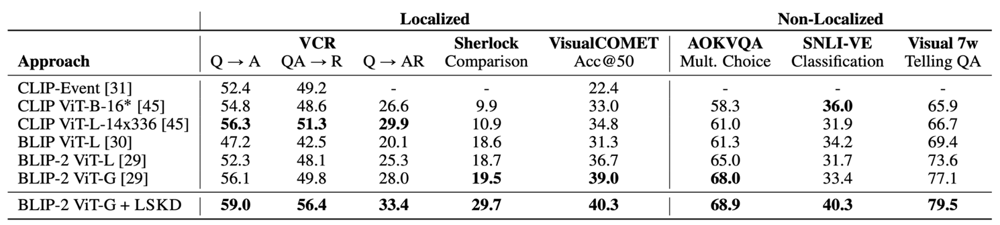

# Localized Symbolic Knowledge Distillation for Visual Commonsense Models [Neurips 2023]

Repo for **LSKD**: Distilling **localized** (e.g. bounding boxes), **visual commonsense** knowledge to Visual Language Models with ChatGPT generated data and filtering.

[[paper](https://arxiv.org/abs/2312.04837)] [[dataset](https://storage.googleapis.com/ai2-jamesp-public/msymkd/data/lskd/train_critic_input_all_vcr_vg_region_verbalizations~chatgpt_qar_filtered_threshold_0.8_1M.jsonl)]


## The Localized Commonsense Knowledge (LCK) Dataset
Dataset with localized reasoning is provided [here](https://storage.googleapis.com/ai2-jamesp-public/msymkd/data/lskd/train_critic_input_all_vcr_vg_region_verbalizations~chatgpt_qar_filtered_threshold_0.8_1M.jsonl)  
```
>>> pprint(df.iloc[1])
image                                       VG_100K/2348412.jpg
source                             chatgpt_region_any_v4_people
split                                                     train
index                       chatgpt_region_any_v4_people-858297
region                                                      [4]
region_all                                            [0, 2, 4]
references    [{'name': '4', 'boxes': [[379.6391601562, 152....
question      [What, is, the, significance, of, the, gold, l...
answer        [The, gold, lion, on, the, woman's, shirt, in,...
rationale     [Lions, are, often, used, as, symbols, of, str...
prediction                                             0.940065
```

## Distillation Results



## Model Training and Evaluation
We use the Salesforce LAVIS [repo](https://github.com/salesforce/LAVIS) to train and evaluate the knowledge distillation pipeline.

### Installation

```
pip install -e .
```

### Downstream Task Evaluation

You can download the BLIP2 + LSKD model [[here](https://storage.googleapis.com/ai2-jamesp-public/msymkd/ckpt/BLIP2/Unified_qa_chatgpt_pretrain1_v2/boxes_480_contrastive_1M/checkpoint_best.pth)]

To run the evaluation on localized datasets, adjust `$CHECKPOINT_DIR` and run the script:
```
bash run_scripts/blip2/eval/eval_unified_common_sense.sh
```


### Critic Model for Data Filtering
We also release the critic model used to filter the irrelevant generated data.
You can download the finetuned critic model [[here](https://storage.googleapis.com/ai2-jamesp-public/msymkd/ckpt/BLIP2/unified_vqa_critic_v2/checkpoint_best.pth)]

Run the following command to run the finetuned critic model in distriubted setting.
This saves the output json file in `run.output_dir`
```
torchrun --nproc_per_node=4 evaluate.py --cfg-path lavis/projects/blip2/eval/laion/laion_sample_critic_ft_filtering.yaml \
  --options run.output_dir=output/BLIP2/laion_samples/filtering/critic_ft/
```

## References
```
@inproceedings{Park2023LocalizedSK,
  title={Localized Symbolic Knowledge Distillation for Visual Commonsense Models},
  author={Jae Sung Park and Jack Hessel and Khyathi Raghavi Chandu and Paul Pu Liang and Ximing Lu and Peter West and Youngjae Yu and Qiuyuan Huang and Jianfeng Gao and Ali Farhadi and Yejin Choi},
  year={2023},
  url={https://api.semanticscholar.org/CorpusID:266149843}
}
```
